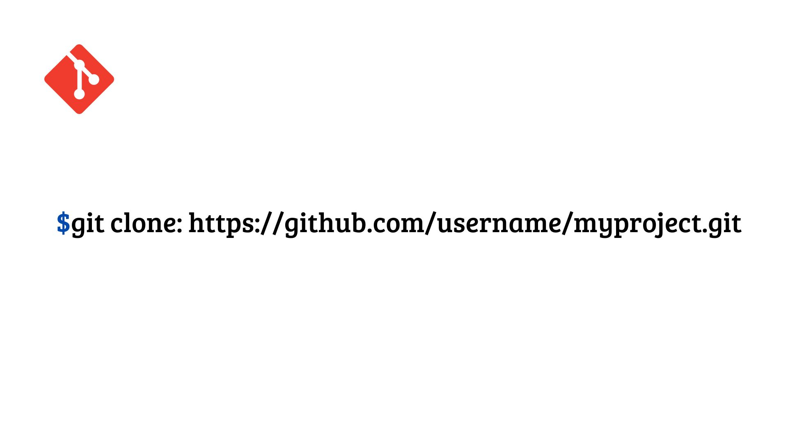
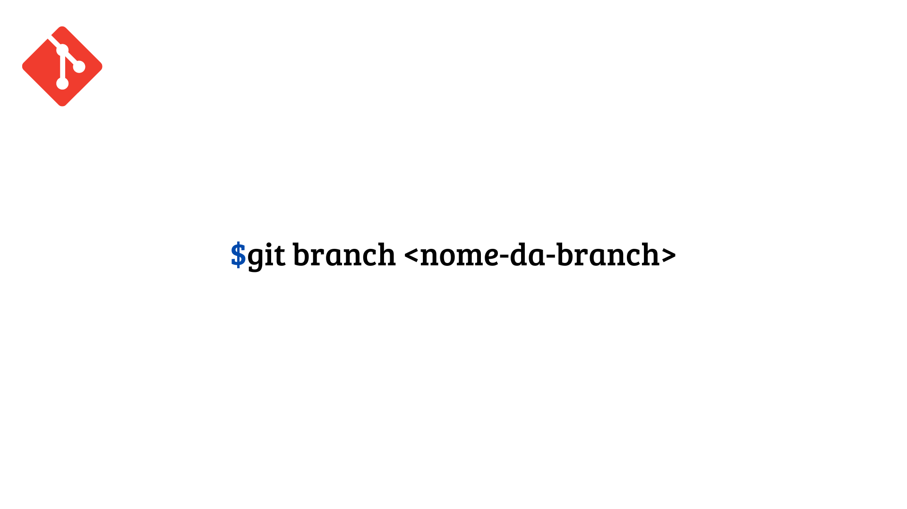
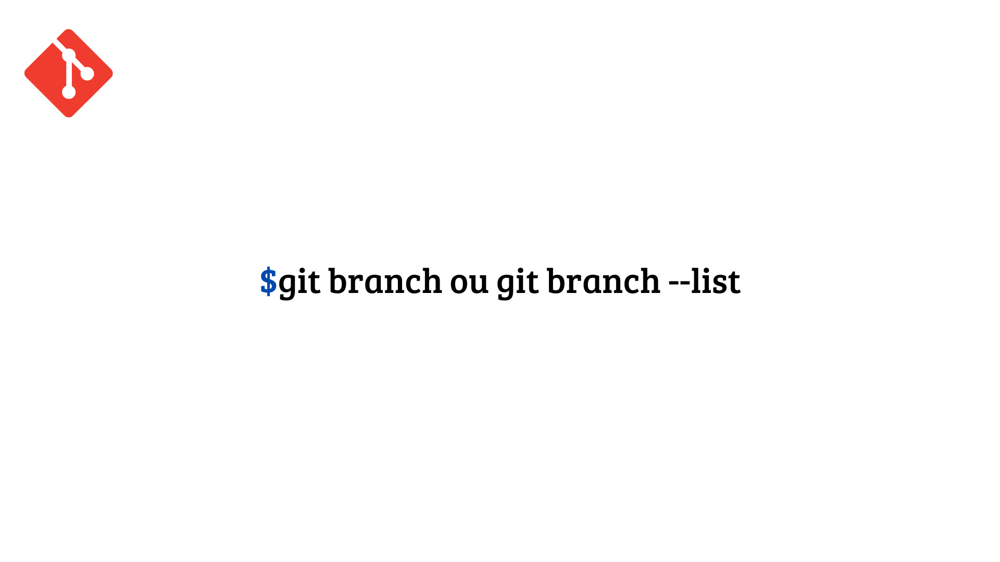
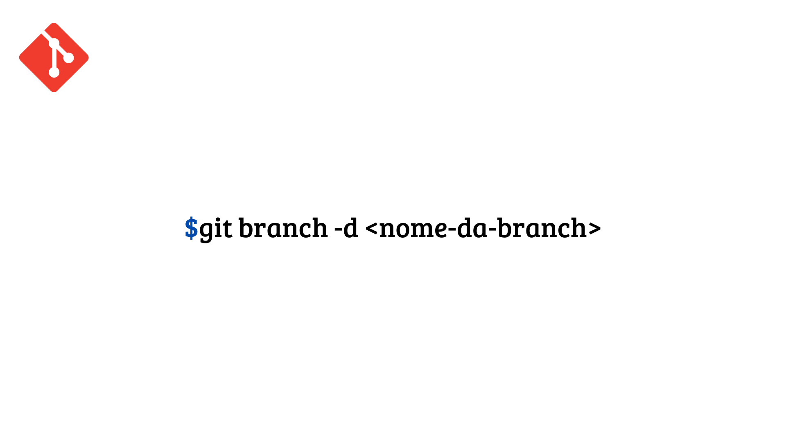
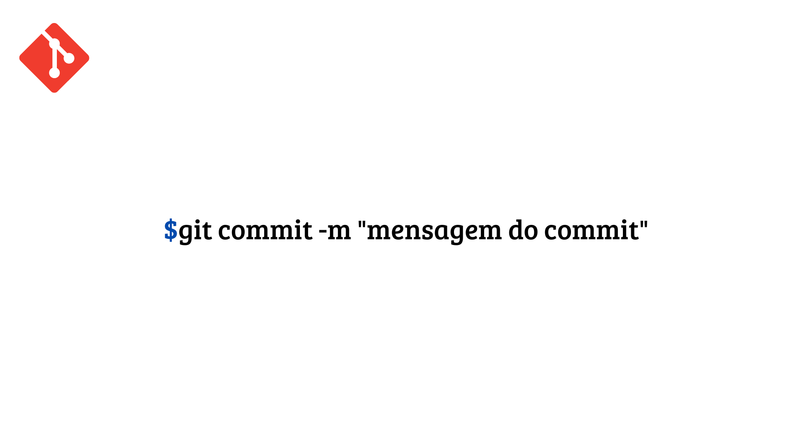
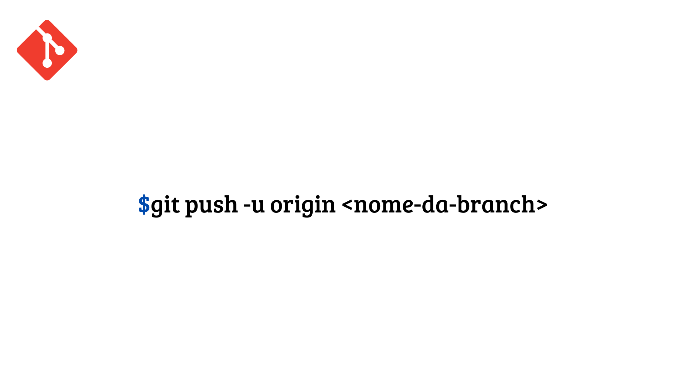
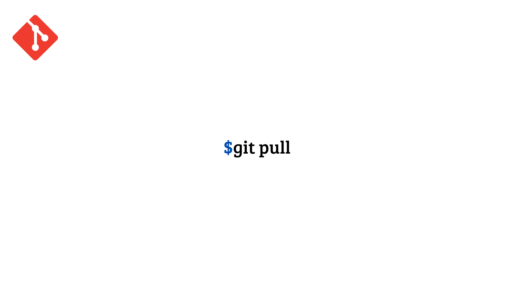
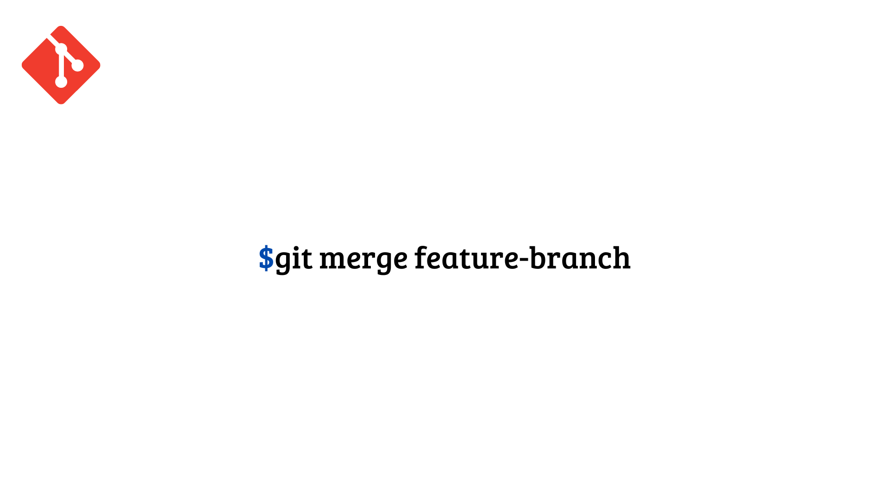

# Relatório de Estudos

**Nome do Estagiário:** Letícia Anhaia 
**Data:** 02/08/2024

**Módulos/Etapas Feitas:**  
1. **Engenharia de Dados**
2. **Git/GitFlow**

## Resumo dos módulos 

# Engenharia de Dados
A engenharia de dados é essencial para criar e manter sistemas e infraestruturas que lidam com grandes volumes de dados. Os engenheiros de dados têm a missão de garantir que esses dados estejam acessíveis, seguros e prontos para serem utilizados por analistas, cientistas de dados e outras partes interessadas na organização. Eles trabalham nos bastidores, construindo a fundação que torna possível coletar, armazenar, processar e analisar dados de forma eficaz.

# Git

 Sistema mais utilizado no controle de versão distribuído, usado principalmente em desenvolvimento de Software, podendo ser usado também para registrar histórico de edições de qualquer arquivo. 

# GitFlow

 Fluxo de trabalho muito utilizado para se trabalhar em equipes e auxilia na organização dos códigos, facilitando no dia a dia dos desenvolvedores. O GitFlow trabalha com duas branchs principais, sendo elas a Master (ou Main) e Develop, também conta com branchs de suporte sendo a feature, release e hotfix que são temporários e duram até realizar o merge com as branches principais.

 Em vez de usar apenas a branch Master, esse fluxo de trabalho utiliza duas branches principais para registrar o histórico do projeto. A branch Master é onde fica armazenado o histórico das versões oficiais de lançamento. Já a branch Develop serve como um ponto de integração para os novos recursos e desenvolvimentos que estão sendo feitos.

**Principais comandos: (se aplicável)**  
- [git clone]: faz uma cópia idêntica da versão mais recente de um projeto em um repositório e a salva em seu computador.

- [git branch]: Usando as branches,os desenvolvedores conseguem trabalhar em paralelo no mesmo projeto. Podemos usar o comando git branch para criar, listar e excluir.

- [git commit]:ele leva as mudanças de um ambiente local para o repositório no git, permitindo ainda a inserção de uma mensagem descritiva. Assim, a cada mudança ou finalização de uma tarefa, a pessoa desenvolvedora pode submeter seus comentários e deixar claro para as outras pessoas o que ela fez.

- [git push]:Após fazer o commit de suas alterações, a próxima coisa a fazer é enviar suas alterações ao servidor remoto. Git push faz o upload dos seus commits no repositório remoto.

- [git pull]: atualiza o seu repositório local com as atualizações mais recentes do repositório remoto.

- [git merge]: assim que concluído o desenvolvimento de sua branch a etapa final é realizar o merge, que é unir tudo a uma unica branch (master ou main).

