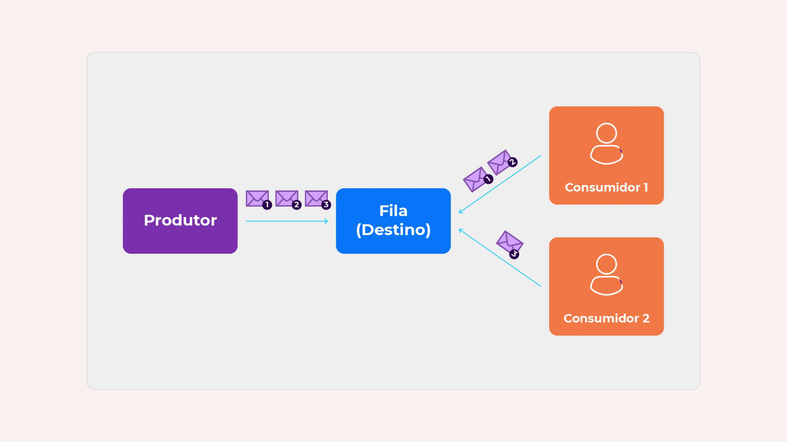
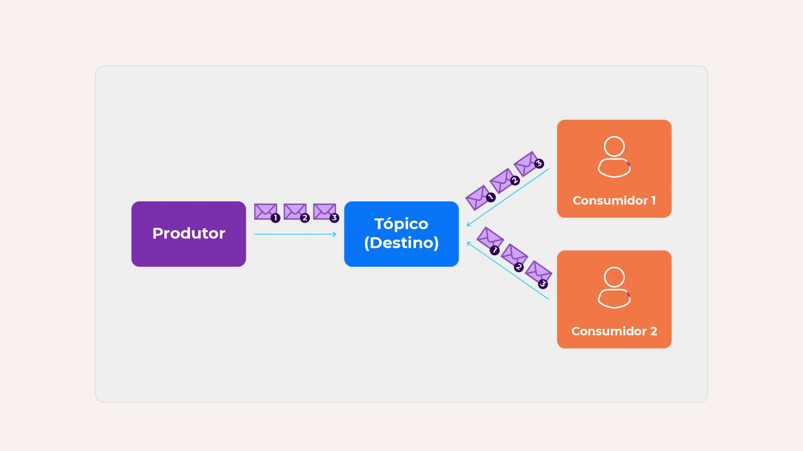

# Relatório de Estudos

**Nome do Estagiário:** Letícia Anhaia  
**Data:** 20/08/2024

**Módulos/Etapas Feitas:**  
1. **Mensageria**
2. **Virtualização**
3. **[Módulo/Etapa 3]** 
4. ...

## Resumo dos módulos 

# 1. Mensageria

É uma abordagem de desenvolvimento usando mensagem para estabelecer comunicação / integração síncrona ou assíncrona entre aplicações, usando um Message Broker ou um MOM. 

Message Broker ou MOM (Message Oriented Middleware) nada mais é que um servidor (infraestrutura) idealizado únicamente para processar e suportar o envio/recebimento, redirecionamento e também a monitoria das mensagens compartilhadas entre os sistemas integrados por mensagem.
Os message brokers podem validar, armazenar, rotear e entregar mensagens aos destinos apropriados. Eles atuam como intermediários entre outros aplicativos, permitindo que os remetentes emitam mensagens sem saber onde estão os destinatários, se eles estão ativos ou não ou quantos deles existem. Isso facilita o desacoplamento de processos e serviços dentro de sistemas.

**Tipos de Mensageria**
- **Modelo Point-to-Point (Ponto a Ponto)**:  esse é o padrão de distribuição utilizado em filas de mensagens com um relacionamento de um a um entre o remetente e o destinatário da mensagem.

- **Modelo Publish/Subscribe (Publicar/Assinar)**:  nesse padrão de distribuição de mensagens, também chamado de "pub/sub", o produtor de cada mensagem a publica em um tópico e diversos consumidores de mensagens se inscrevem nos tópicos para receber as mensagens.

**Exemplos de Sistemas de Mensageria**

- RabbitMQ: é um message broker, atua como intermediário na gestão de envio e recebimento de mensagens de uma ou mais aplicações.

- Apache Kafka: é uma plataforma distribuída de transmissão de dados que é capaz de publicar, subscrever, armazenar e processar fluxos de registro em tempo real.

- Google Cloud Pub/Sub: serviço de mensagens em tempo real totalmente gerenciado que permite o envio e o recebimento de mensagens entre aplicativos independentes.

- Apache ActiveMQ: broker de mensagens de uso geral que suporta vários protocolos de mensagens, como AMQP, STOMP, MQTT. Em geral, é usado principalmente para integração entre aplicativos / serviços, especialmente em uma Arquitetura Orientada a Serviços.

**Vantagens do Uso de Mensageria**
- A aplicação produtora da mensagem não precisa se preocupar se a aplicação consumidora está disponível no momento do envio.

- Provê baixo acoplamento na integração entre sistemas, deixando a comunicação assíncrona.

- É possível tentar consumir a mensagem mesmo após uma falha, devido a mesma estar enfileirada no Broker.

- Uso de eventos para compartilhamento de dados ajuda a manter a consistência de dados e também comunicação assíncrona.

**Desvantagens do Uso de Mensageria**
- O desenvolvimento de sistemas ou microserviços usando esse tipo de integração, podem ficar mais complexos que o normal.

- Não adequado para cenários que exijam um modelo mais síncrono na forma de comunicação entre sistemas.

# **Google Pub/Sub**

 serviço de mensagens assíncronas e distribuídas fornecido pelo Google Cloud Platform. Ele permite que os aplicativos se comuniquem de forma confiável e escalável, enviando e recebendo mensagens entre componentes independentes.
 O Pub/Sub é projetado para lidar com grandes volumes de dados e suportar uma alta taxa de transferência, tornando-o ideal para aplicativos que precisam processar e trocar informações em tempo real.

**Como funciona o Google Cloud Pub/Sub?**

O Google Cloud Pub/Sub opera com base no modelo de publicação e assinatura. Os aplicativos podem publicar mensagens em tópicos, que são canais de comunicação unidirecionais. Essas mensagens são então entregues a todos os assinantes interessados nesse tópico. Os assinantes podem ser aplicativos ou serviços que desejam receber e processar as mensagens. O Pub/Sub garante a entrega confiável das mensagens e permite que os assinantes processem as mensagens em seu próprio ritmo.

**Benefícios**
- Escalabilidade: capaz de lidar com grandes volumes de dados e suportar uma alta taxa de transferência. 

- Confiabilidade: garante a entrega confiável das mensagens, mesmo em caso de falhas de rede ou indisponibilidade temporária dos assinantes.

- lexibilidade: suporta uma variedade de padrões de integração, permitindo que os aplicativos se comuniquem de maneira eficiente com outros serviços do Google Cloud Platform, bem como com serviços de terceiros.

- Baixa latência: projetado para oferecer baixa latência, permitindo que os aplicativos processem as mensagens em tempo real.

**Casos de uso**
- **Streaming de dados**: ideal para casos de uso que envolvem streaming de dados em tempo real, como análise de dados em tempo real, processamento de eventos e monitoramento de sistemas distribuídos.

- **Integração de serviços**: pode ser usado para integrar serviços e aplicativos em nuvem, permitindo que eles se comuniquem de forma eficiente e confiável.

- **Processamento de eventos**: pode ser usado para implementar um sistema de eventos distribuído, onde os eventos são publicados em tópicos e os assinantes interessados podem processar esses eventos de acordo com suas necessidades.

- **Filas de mensagens**: pode ser usado como uma fila de mensagens para processar tarefas em segundo plano de forma assíncrona.

Em resumo, o Google Cloud Pub/Sub é um serviço poderoso e escalável para troca de mensagens assíncronas e distribuídas. Ele oferece benefícios como escalabilidade, confiabilidade, flexibilidade e baixa latência. 

# 2. Virtualização

Virtualização é a tecnologia que você pode usar para criar representações virtuais de servidores, armazenamento, redes e outras máquinas físicas. O software virtual imita as funções do hardware físico para executar várias máquinas virtuais simultaneamente em uma única máquina física. 

**Máquinas virtuais (VMs)**
A máquina virtual funciona como um único arquivo de dados. E como qualquer outro arquivo digital, ela pode ser transferida de um computador a outro, aberta em qualquer um e funcionar da mesma forma. Quando o ambiente virtual está em execução e um programa ou usuário emite uma instrução que requer recursos adicionais do ambiente físico, o hipervisor retransmite a solicitação ao sistema físico e armazena as mudanças em cache.

**Maneiras de usar máquinas virtuais**:
- Criar e implantar aplicativos na nuvem.
Experimentar um novo SO (sistema operacional), incluindo versões beta.

- Criar um novo ambiente para tornar a execução de cenários de desenvolvimento e teste mais simples e rápida para os desenvolvedores.

- Fazer backup de seu sistema operacional existente.

- Acessar dados infectados por vírus ou executar um aplicativo antigo instalando um sistema operacional mais antigo.

- Executar software ou aplicativos em sistemas operacionais para os quais eles não foram originalmente destinados.

**Tipos de virtualização**
- Virtualização de hardware:
A virtualização de hardware, incluindo versões de computadores e sistemas operacionais (VMs), cria um servidor primário único, virtual e consolidado.

- Virtualização de software:
Cria um sistema de computador, incluindo hardware, que permite que um ou mais sistemas operacionais hospedados sejam executados em uma máquina host física.

- Virtualização de armazenamento:
Virtualiza o armazenamento ao consolidar vários dispositivos de armazenamento físico, que aparecem como uma única unidade de armazenamento para melhor desempenho e maior velocidade.

- Virtualização de redes:
Permite que haja uma rede virtual em nuvem orientada por aplicativos em um conjunto totalmente distribuído de sistemas, desacoplando da infraestrutura de rede física.

- Virtualização da área de trabalho:
Separa seu ambiente de área de trabalho do dispositivo físico e armazena uma área de trabalho em um servidor remoto, permitindo o acesso de qualquer lugar em qualquer dispositivo.

**Benefícios**: 
- Economia de custos 
- Agilidade e velocidade
- Tempo de inatividade reduzido
- Escalabilidade
- Benefícios de segurança

# Docker
é um software que fornece ambientes virtualizados que empacotam todo um sistema operacional e sua aplicação para dentro de um container. O Docker também automatiza a implantação da aplicação (ou de conjuntos de processos que constituem uma app) dentro desse ambiente de containers.

**Container Docker**
 O objetivo dos containers é criar independência: a habilidade de executar diversos processos e apps separadamente para utilizar melhor a infraestrutura e, ao mesmo tempo, manter a segurança que você teria em sistemas separados.

 

**Benefícios**
- Economia de recursos

- Melhor disponibilidade do sistema (pelo compartilhamento do SO e de outros componentes).

- Possibilidades de compartilhamento

- Simplicidade de criação e alteração da infraestrutura.

- Manutenção simplificada (reduzindo o esforço e o risco de problemas com as dependências do aplicativo).

# Kubernets

**Recursos Utilizados:**  
- [Recurso 1]
- [Recurso 2]
- [Recurso 3]
- ...

**Desafios Encontrados:**  
Descreva quaisquer desafios ou obstáculos que você encontrou durante a trilha de aprendizagem e como você os superou ou planeja superá-los.

**Feedback e Ajustes:**  
Descreva qualquer feedback que você recebeu e como você ajustou sua abordagem de estudo com base nesse feedback.

**Próximos Passos:**  
Descreva os próximos passos em sua trilha de aprendizagem. Quais são as próximas etapas ou módulos que você irá abordar?