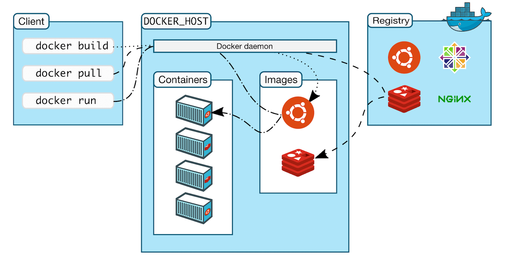

# Relatório de Estudos

**Nome do Estagiário:** Letícia Anhaia  
**Data:** 20/08/2024

**Módulos/Etapas Feitas:**  
1. **Mensageria**
2. **Virtualização**
3. **Computação em Nuvem** 
4. **Linux/Shell**

## Resumo dos módulos 

# 1. Mensageria

É uma abordagem de desenvolvimento usando mensagem para estabelecer comunicação / integração síncrona ou assíncrona entre aplicações, usando um Message Broker ou um MOM. 

Message Broker ou MOM (Message Oriented Middleware) nada mais é que um servidor (infraestrutura) idealizado únicamente para processar e suportar o envio/recebimento, redirecionamento e também a monitoria das mensagens compartilhadas entre os sistemas integrados por mensagem.
Os message brokers podem validar, armazenar, rotear e entregar mensagens aos destinos apropriados. Eles atuam como intermediários entre outros aplicativos, permitindo que os remetentes emitam mensagens sem saber onde estão os destinatários, se eles estão ativos ou não ou quantos deles existem. Isso facilita o desacoplamento de processos e serviços dentro de sistemas.

**Tipos de Mensageria**
- **Modelo Point-to-Point (Ponto a Ponto)**:  esse é o padrão de distribuição utilizado em filas de mensagens com um relacionamento de um a um entre o remetente e o destinatário da mensagem.

- **Modelo Publish/Subscribe (Publicar/Assinar)**:  nesse padrão de distribuição de mensagens, também chamado de "pub/sub", o produtor de cada mensagem a publica em um tópico e diversos consumidores de mensagens se inscrevem nos tópicos para receber as mensagens.

**Exemplos de Sistemas de Mensageria**

- RabbitMQ: é um message broker, atua como intermediário na gestão de envio e recebimento de mensagens de uma ou mais aplicações.

- Apache Kafka: é uma plataforma distribuída de transmissão de dados que é capaz de publicar, subscrever, armazenar e processar fluxos de registro em tempo real.

- Google Cloud Pub/Sub: serviço de mensagens em tempo real totalmente gerenciado que permite o envio e o recebimento de mensagens entre aplicativos independentes.

- Apache ActiveMQ: broker de mensagens de uso geral que suporta vários protocolos de mensagens, como AMQP, STOMP, MQTT. Em geral, é usado principalmente para integração entre aplicativos / serviços, especialmente em uma Arquitetura Orientada a Serviços.

**Vantagens do Uso de Mensageria**
- A aplicação produtora da mensagem não precisa se preocupar se a aplicação consumidora está disponível no momento do envio.

- Provê baixo acoplamento na integração entre sistemas, deixando a comunicação assíncrona.

- É possível tentar consumir a mensagem mesmo após uma falha, devido a mesma estar enfileirada no Broker.

- Uso de eventos para compartilhamento de dados ajuda a manter a consistência de dados e também comunicação assíncrona.

**Desvantagens do Uso de Mensageria**
- O desenvolvimento de sistemas ou microserviços usando esse tipo de integração, podem ficar mais complexos que o normal.

- Não adequado para cenários que exijam um modelo mais síncrono na forma de comunicação entre sistemas.

# 1.2 **Google Pub/Sub**

 serviço de mensagens assíncronas e distribuídas fornecido pelo Google Cloud Platform. Ele permite que os aplicativos se comuniquem de forma confiável e escalável, enviando e recebendo mensagens entre componentes independentes.
 O Pub/Sub é projetado para lidar com grandes volumes de dados e suportar uma alta taxa de transferência, tornando-o ideal para aplicativos que precisam processar e trocar informações em tempo real.

**Como funciona o Google Cloud Pub/Sub?**

O Google Cloud Pub/Sub opera com base no modelo de publicação e assinatura. Os aplicativos podem publicar mensagens em tópicos, que são canais de comunicação unidirecionais. Essas mensagens são então entregues a todos os assinantes interessados nesse tópico. Os assinantes podem ser aplicativos ou serviços que desejam receber e processar as mensagens. O Pub/Sub garante a entrega confiável das mensagens e permite que os assinantes processem as mensagens em seu próprio ritmo.

**Benefícios**
- Escalabilidade: capaz de lidar com grandes volumes de dados e suportar uma alta taxa de transferência. 

- Confiabilidade: garante a entrega confiável das mensagens, mesmo em caso de falhas de rede ou indisponibilidade temporária dos assinantes.

- lexibilidade: suporta uma variedade de padrões de integração, permitindo que os aplicativos se comuniquem de maneira eficiente com outros serviços do Google Cloud Platform, bem como com serviços de terceiros.

- Baixa latência: projetado para oferecer baixa latência, permitindo que os aplicativos processem as mensagens em tempo real.

**Casos de uso**
- **Streaming de dados**: ideal para casos de uso que envolvem streaming de dados em tempo real, como análise de dados em tempo real, processamento de eventos e monitoramento de sistemas distribuídos.

- **Integração de serviços**: pode ser usado para integrar serviços e aplicativos em nuvem, permitindo que eles se comuniquem de forma eficiente e confiável.

- **Processamento de eventos**: pode ser usado para implementar um sistema de eventos distribuído, onde os eventos são publicados em tópicos e os assinantes interessados podem processar esses eventos de acordo com suas necessidades.

- **Filas de mensagens**: pode ser usado como uma fila de mensagens para processar tarefas em segundo plano de forma assíncrona.

Em resumo, o Google Cloud Pub/Sub é um serviço poderoso e escalável para troca de mensagens assíncronas e distribuídas. Ele oferece benefícios como escalabilidade, confiabilidade, flexibilidade e baixa latência. 

# 2. Virtualização

Virtualização é a tecnologia que você pode usar para criar representações virtuais de servidores, armazenamento, redes e outras máquinas físicas. O software virtual imita as funções do hardware físico para executar várias máquinas virtuais simultaneamente em uma única máquina física. 

**Máquinas virtuais (VMs)**
A máquina virtual funciona como um único arquivo de dados. E como qualquer outro arquivo digital, ela pode ser transferida de um computador a outro, aberta em qualquer um e funcionar da mesma forma. Quando o ambiente virtual está em execução e um programa ou usuário emite uma instrução que requer recursos adicionais do ambiente físico, o hipervisor retransmite a solicitação ao sistema físico e armazena as mudanças em cache.

**Maneiras de usar máquinas virtuais**:
- Criar e implantar aplicativos na nuvem.
Experimentar um novo SO (sistema operacional), incluindo versões beta.

- Criar um novo ambiente para tornar a execução de cenários de desenvolvimento e teste mais simples e rápida para os desenvolvedores.

- Fazer backup de seu sistema operacional existente.

- Acessar dados infectados por vírus ou executar um aplicativo antigo instalando um sistema operacional mais antigo.

- Executar software ou aplicativos em sistemas operacionais para os quais eles não foram originalmente destinados.

**Tipos de virtualização**
- Virtualização de hardware:
A virtualização de hardware, incluindo versões de computadores e sistemas operacionais (VMs), cria um servidor primário único, virtual e consolidado.

- Virtualização de software:
Cria um sistema de computador, incluindo hardware, que permite que um ou mais sistemas operacionais hospedados sejam executados em uma máquina host física.

- Virtualização de armazenamento:
Virtualiza o armazenamento ao consolidar vários dispositivos de armazenamento físico, que aparecem como uma única unidade de armazenamento para melhor desempenho e maior velocidade.

- Virtualização de redes:
Permite que haja uma rede virtual em nuvem orientada por aplicativos em um conjunto totalmente distribuído de sistemas, desacoplando da infraestrutura de rede física.

- Virtualização da área de trabalho:
Separa seu ambiente de área de trabalho do dispositivo físico e armazena uma área de trabalho em um servidor remoto, permitindo o acesso de qualquer lugar em qualquer dispositivo.

**Benefícios**: 
- Economia de custos 
- Agilidade e velocidade
- Tempo de inatividade reduzido
- Escalabilidade
- Benefícios de segurança

# 2.2 Docker
é um software que fornece ambientes virtualizados que empacotam todo um sistema operacional e sua aplicação para dentro de um container. O Docker também automatiza a implantação da aplicação (ou de conjuntos de processos que constituem uma app) dentro desse ambiente de containers.

**Container Docker**
O objetivo dos containers é criar independência: a habilidade de executar diversos processos e apps separadamente para utilizar melhor a infraestrutura e, ao mesmo tempo, manter a segurança que você teria em sistemas separados.

Container nada mais é do que um ambiente isolado, disposto em um servidor, que divide um único host de controle.
Um navio cargueiro pode carregar diversos containers. Caso um dos recipientes seja danificado, os demais não são afetados. Afinal, são isolados, protegidos e estão carregando seus próprios produtos.

Cada container possui uma função e sua responsabilidade. Caso um deles sofra um dano, o funcionamento do sistema não para e a função afetada é redirecionada para um novo container.

 

**Benefícios**
- Economia de recursos

- Melhor disponibilidade do sistema (pelo compartilhamento do SO e de outros componentes).

- Possibilidades de compartilhamento

- Simplicidade de criação e alteração da infraestrutura.

- Manutenção simplificada (reduzindo o esforço e o risco de problemas com as dependências do aplicativo).

# 2.3 Kubernets
Kubernetes simplifica a vida de quem gerencia aplicativos em contêineres. Ele cuida automaticamente de tarefas que normalmente seriam repetitivas e demoradas, como colocar uma nova versão do aplicativo no ar, aumentar ou diminuir a capacidade conforme a demanda, e acompanhar o desempenho. Tudo isso ajuda a garantir que seus aplicativos funcionem de maneira suave e eficiente, sem precisar de tanta intervenção manual.

**Benefícios**
- Flexibilidade: extremamente flexível, funcionando em qualquer tipo de execução de containers. 

- Experiência do usuário: evitam que erros invadam outras funcionalidades, pois isola cada uma dentro da sua própria aplicação.

- Segurança: por meio de criação de imagens protegidas, a implementação de containers ocorre de forma segura, assim conservando as aplicações.

# 3. Google Cloud Dataflow

O Google Cloud Dataflow é um serviço de processamento de dados em tempo real e em lote oferecido pelo Google Cloud Platform. Ele permite que as empresas processem grandes volumes de dados de forma eficiente e escalável, facilitando a análise e a extração de insights valiosos.

O Google Cloud Dataflow utiliza o modelo de programação Apache Beam para processar dados. Ele permite que os desenvolvedores escrevam código em várias linguagens, como Java, Python e Go, para definir as transformações que serão aplicadas aos dados. 

**Aplicações**
- Análise de dados em tempo real: permite que as empresas processem e analisem dados em tempo real, obtendo insights valiosos para tomada de decisões rápidas e eficientes.

- Processamento de dados em lote: pode ser usado para processar grandes volumes de dados em lote, permitindo que as empresas realizem análises retrospectivas e identifiquem padrões e tendências ao longo do tempo.

- Processamento de streaming: uporta o processamento de dados em streaming, permitindo que as empresas processem e analisem dados em tempo real à medida que eles são gerados.

**Benefícios**

- Escala automática: é capaz de escalar automaticamente para lidar com grandes volumes de dados.

- Flexibilidade: oferece flexibilidade aos desenvolvedores, permitindo que eles escrevam código em várias linguagens e usem bibliotecas e frameworks populares.

- Uso de recursos otimizado: otimiza o uso de recursos, permitindo que os desenvolvedores utilizem apenas os recursos necessários para processar os dados.

O Google Cloud Dataflow é uma poderosa ferramenta de processamento de dados na nuvem, que oferece recursos avançados e uma integração perfeita com outros serviços da Google Cloud Platform. Com sua capacidade de processamento em tempo real e em lote, escalabilidade automática e recursos de gerenciamento de estado, o Dataflow é uma escolha popular para empresas que precisam lidar com grandes volumes de dados e realizar análises em tempo real.

# 3.2 Google Cloud Dataproc
O Google Cloud Dataproc é um serviço de big data totalmente gerenciado que permite executar clusters Apache Hadoop e Apache Spark de maneira rápida e fácil. Ele oferece uma plataforma escalável e flexível para processamento de dados em larga escala, permitindo que as empresas aproveitem ao máximo seus dados e obtenham insights valiosos.

**Estrutura do Google Cloud Dataproc**
- Hospedagem e programação;
- Armazenamento (Cloud Storage, Cloud SQL, Cloud Datastorage);
- Big Data (Big Query);
- Serviços (Cloud Endpoints, Translate API, Prediction API).

**Benefícios**
- Custos menores: o Cloud Dataproc cobra por CPU por hora no cluster. Ou seja, o valor é cobrado pelo que você realmente usa.

- Velocidade: basta 90 segundos para criar um cluster

- Facilidade: você não precisa usar novas ferramentas, tecnologias ou APIs para aproveitar o potencial do Google Cloud Dataproc.

- Integração: a ferramenta pode ser facilmente integrada a vários serviços do Google Cloud, como BigQuery, Google Cloud Bigtable, Google Cloud Logging ou Google Cloud Storage.

# 3.3 Google Cloud Composer 

O Google Cloud Composer é um serviço gerenciado que simplifica a criação e o gerenciamento de workflows complexos. Baseado no Apache Airflow, ele permite que você crie, agende e monitore pipelines de dados, tudo na nuvem. Ao usar o Cloud Composer, você se beneficia das capacidades do Airflow sem precisar se preocupar com a instalação e manutenção, aproveitando uma interface web intuitiva e ferramentas de linha de comando para gerenciar seus workflows de forma eficiente.

**Casos de uso**
- ETL e Processamento de Dados: amplamente utilizado para orquestrar pipelines de ETL (extração, transformação e carregamento) e processamento de dados em larga escala.

- Automação de Tarefas e Processos de Negócio: Empresas utilizam o Composer para automatizar tarefas recorrentes e processos de negócios, como a geração de relatórios, sincronização de dados entre sistemas e monitoramento de compliance.

- Machine Learning e AI: pode orquestrar o fluxo de trabalho completo, desde a preparação dos dados até o treinamento, validação e implantação de modelos de aprendizado de máquina.

**Benefícios**
- Redução da Complexidade Operacional
- Agilidade no Desenvolvimento e Implantação
- Flexibilidade e Integração

O Google Cloud Composer é uma ferramenta poderosa para a orquestração de workflows complexos na nuvem, oferecendo integração robusta com serviços do Google Cloud e outras plataformas. Ao simplificar a gestão da infraestrutura e proporcionar escalabilidade automática, o Composer permite que as organizações se concentrem na lógica de seus processos e na inovação, reduzindo a complexidade operacional e aumentando a agilidade.

# 3.4 Google Cloud Functions

 O Google Cloud Functions é um serviço de computação em nuvem oferecido pelo Google Cloud Platform que permite executar código sem a necessidade de provisionar ou gerenciar servidores dedicados.

 O Cloud Functions é uma ferramenta prática que permite você escrever e implantar pequenos pedaços de código que são executados automaticamente em resposta a eventos, como o envio de um e-mail ou a chegada de uma nova mensagem. Ele ajusta automaticamente a quantidade de recursos necessários conforme o número de eventos, e você só paga pelo tempo que seu código realmente está rodando. Isso elimina a necessidade de se preocupar com a configuração e manutenção de servidores, tornando o desenvolvimento de aplicativos na nuvem muito mais fácil e eficiente.

**Benefícios**
- Escalabilidade automática: dimensiona automaticamente suas funções com base na carga de trabalho, garantindo que você tenha capacidade suficiente para lidar com picos de tráfego e processamento.

- Integração com outros serviços do Google Cloud
- Pagamento por uso
- Suporte a várias linguagens de programação
- Eventos e acionadores personalizáveis
- Integração com ferramentas de desenvolvimento e CI/CD

# 4. Linux/Shell

Shell script (sh) é uma linguagem de script usada em ambiente de linha de comando. Ela permite automatizar comandos de terminal em sistemas baseados em Unix, como Linux e MacOS. Scripts são arquivos de texto que devem ser salvos com a extensão “.sh“.

Shell: De modo geral, podemos dizer que Shell é uma camada que possibilita aos usuários acessar e configurar comandos no sistema operacional. 

Script: Eles são uma série de instruções que ditam a forma como o aparelho deve executar as tarefas x, sempre de acordo com o programado.

Entretanto, basicamente, existem dois tipos de Shell: o CLI e o GUI.

**CLI**

Sigla de “Command Line Interface”, ou seja, aqueles que têm a interface baseada em uma linha de comando. Em outras palavras, para que qualquer ação seja executada é preciso que um comando equivalente seja digitado.

**GUI**

 Sigla de “Graphical User Interface”.  Neste caso, é feito o uso da interface gráfica para que os mesmo comando não precisem ser digitados mais de uma vez.

 Em resumo, seja através de uma interface gráfica ou com a linhas de comando, o Shell realiza ações básicas do sistema operacional com o intuito de administrar melhor os dados do computador.

 **Características do Shell Script**:

 - Interpretador: indica ao sistema qual interpretador deve ser usado para executar o script. Ao usar #!/bin/bash estamos dizendo que o Bash (/bin/bash) deve ser usado para interpretar o código;

 - Variáveis: armazenam valores que podem ser usados posteriormente;

 - Estruturas de Controle: como if, for, e while permitem que você crie lógica condicional e loops;

 - Funções: permitem que você organize seu código em blocos reutilizáveis;

 - Comentários: começam com # e são usados para documentar seu código.

 O Shell Script é uma ferramenta poderosa. A habilidade de criar scripts personalizados usando comandos de shell, variáveis, estruturas de controle e funções possibilita simplificar tarefas repetitivas e criar soluções para cada necessidade.

 

 **Comandos e Funções Principais**:

 - echo: imprime texto na tela;
 - read: lê entrada do usuário;
 - if: realiza uma ação com base em uma condição;
 - for e while: criam loops;
 - grep, sed, e awk: ferramentas poderosas para processar texto;
 - mv, cp, e rm: manipulam arquivos e diretórios.

**Desafios Encontrados:**  
Entender os conceitos e por onde começar a aplicar. 

**Feedback e Ajustes:**  
Incluir mais vídeos para praticar as ferramentas. 

**Próximos Passos:**  
Se aprofundar em cada um dos temas passados na trilha, mas agora praticando. 