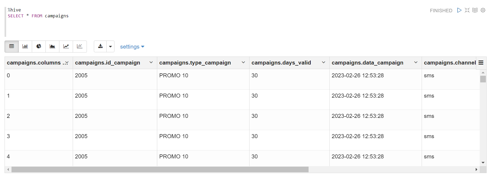
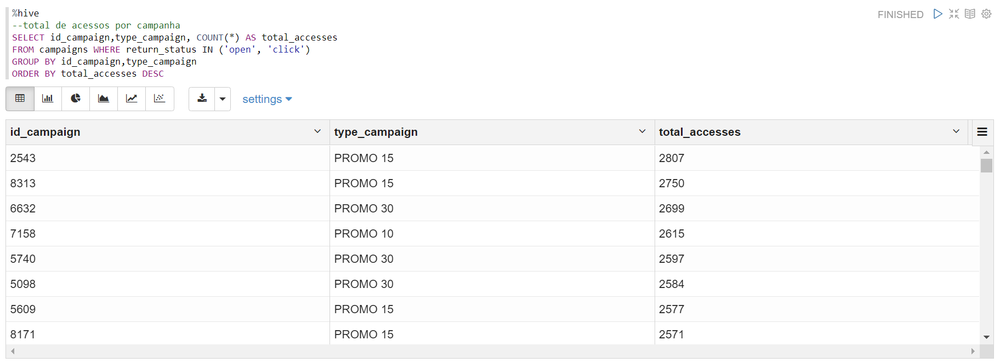
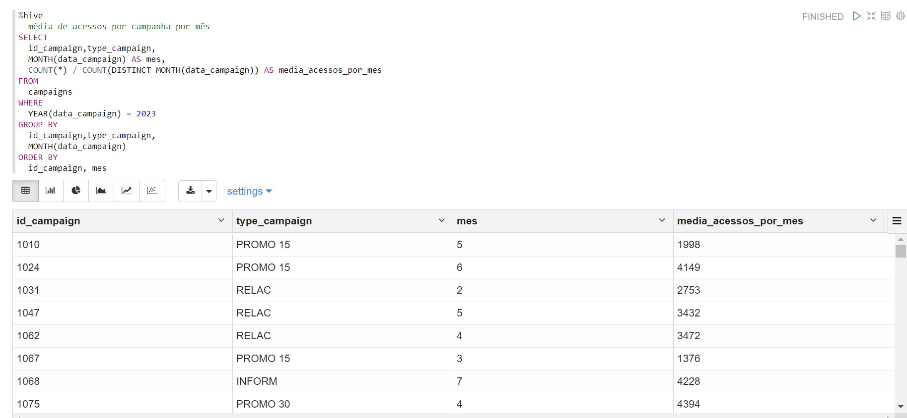
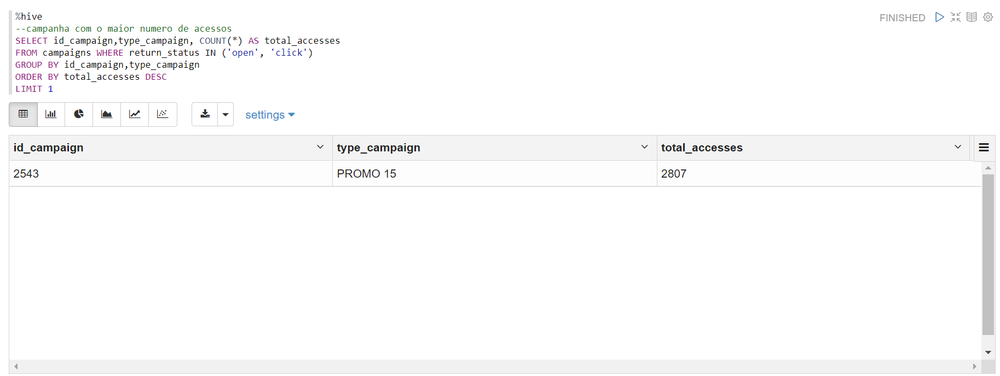
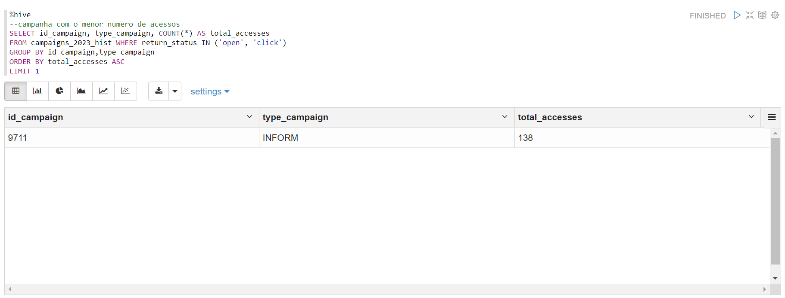

# Tarefa 1 - Exploração e Análise de Dados com SQL

## Carregando os dados pelo Hive
Criando uma tabela e separando as colunas com ",".
```python
%hive
CREATE TABLE campaigns(
    columns STRING,
    id_campaign INT,
    type_campaign STRING,
    days_valid STRING,
    data_campaign STRING,
    channel STRING,
    return_status STRING,
    return_date STRING,
    client_id STRING
)

ROW FORMAT DELIMITED
FIELDS TERMINATED BY ','
STORED AS TEXTFILE
TBLPROPERTIES ("skip.header.line.count"="1") --> aqui faz com que a primeira linha seja ignorada

```
Esse comando carrega o arquivo do Bucket no Minio e insere os dados na minha tabela **campaigns**.
```python
%hive

LOAD DATA INPATH 's3a://tarefa1/campaigns_2023_hist.csv'
INTO TABLE campaign
```

Acessando minha tabela:
```python
%hive

SELECT * FROM campaign
```


## Tratamento dos Dados
Verificando se a minha tabela existe valores nulos:
```python
%hive
SELECT *
FROM campaigns
WHERE columns IS NULL
   OR type_campaign IS NULL
   OR days_valid IS NULL
   OR data_campaign IS NULL
   OR id_campaign IS NULL
   OR channel IS NULL
   OR return_status IS NULL
   OR return_date IS NULL
   OR client_id IS NULL
```
Verificando se minha tabela há dados duplicados:
```python
%hive
SELECT columns, id_campaign, type_campaign, days_valid, data_campaign, channel, return_status, return_date, client_id, COUNT(*)
FROM campaigns
GROUP BY columns, id_campaign, type_campaign, days_valid, data_campaign, channel, return_status, return_date, client_id
HAVING COUNT(*) > 1
LIMIT 100
```
## Criação de Querys
Filtrando a quantidade de acessos que cada campanha obteve:
```python
%hive
SELECT id_campaign,type_campaign, COUNT(*) AS total_accesses
FROM campaigns WHERE return_status IN ('open', 'click')
GROUP BY id_campaign,type_campaign
ORDER BY total_accesses DESC
```


Filtando a quantidade média de acessos que cada campanha obteve por mês:
```python
SELECT
  id_campaign,type_campaign,
  MONTH(data_campaign) AS mes,
  COUNT(*) / COUNT(DISTINCT MONTH(data_campaign)) AS media_acessos_por_mes
FROM
  campaigns
WHERE
  YEAR(data_campaign) = 2023
GROUP BY
  id_campaign,type_campaign,
  MONTH(data_campaign)
ORDER BY
  id_campaign, mes 
```


Filtrando qual campanha obteve mais acessos no mês:
```python
%hive
SELECT id_campaign,type_campaign, COUNT(*) AS total_accesses
FROM campaigns WHERE return_status IN ('open', 'click')
GROUP BY id_campaign,type_campaign
ORDER BY total_accesses DESC
LIMIT 1
```


Filtrando qual campanha obteve o menor acesso no mês:
```python
%hive
SELECT id_campaign, type_campaign, COUNT(*) AS total_accesses
FROM campaigns WHERE return_status IN ('open', 'click')
GROUP BY id_campaign,type_campaign
ORDER BY total_accesses ASC
LIMIT 1
```
