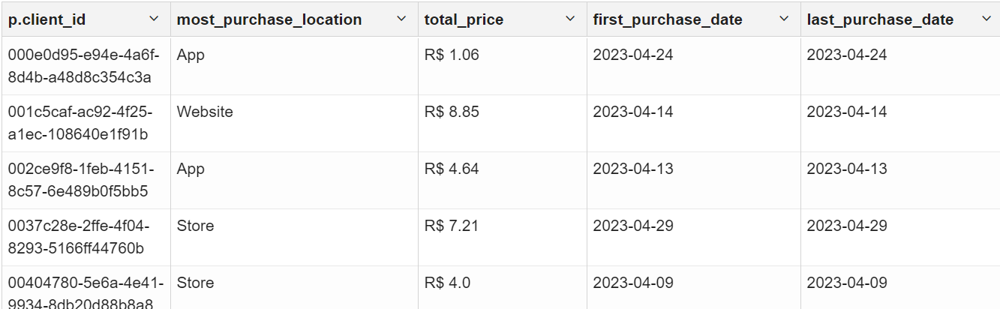
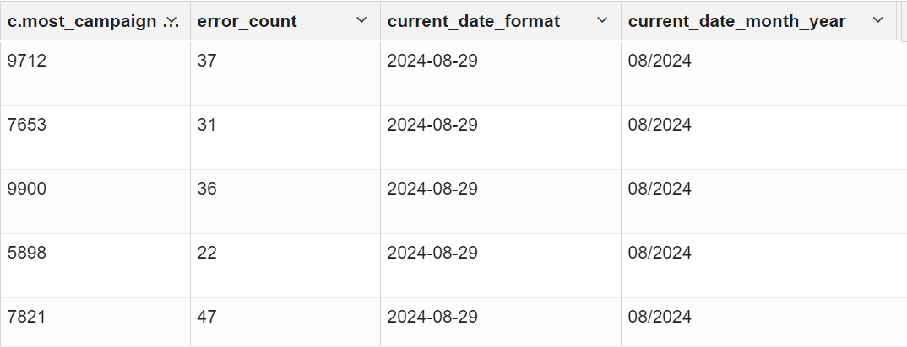

# Tarefa 2 - Criação de Script SQL para Análise de Campanhas e Compras

## Carregando os dados pelo Hive

O objetivo desta tarefa é criar um script SQL que integre esses datasets e retorne uma tabela consolidada com as seguintes informações:

1. client_id: Identificação do cliente.
2. total_price: Total gasto pelo cliente, calculado como (price * amount * discount_applied).
3. most_purchase_location: Local mais utilizado pelo cliente para realizar compras (website, app, store).
4. first_purchase: Data da primeira compra realizada pelo cliente.
5. last_purchase: Data da última compra realizada pelo cliente.
6. most_campaign: Campanha mais recebida pelo cliente.
7. quantity_error: Quantidade de campanhas que retornaram o status "error" para o cliente.
8. date_today: Data atual formatada como YYYY-MM-DD.
9. anomes_today: Data atual formatada como MMYYYY (tipo int).

**Resolução**:

Eu fui passo a passo, criando pequenas consultas para cada parte das informações solicitadas. Primeiro, tratei de um item, depois passei para o próximo, e assim por diante. À medida que avançava, fui juntando as tabelas, combinando os resultados e agrupando tudo em uma única tabela. Dessa forma, no final, consegui reunir todas as informações em um só lugar, resultando em uma tabela completa e organizada.

