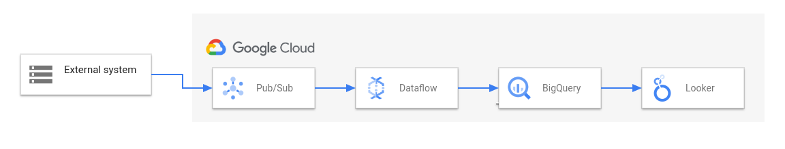

# Relatório de Estudos

**Nome do Estagiário:** Letícia Anhaia  
**Data:** 14/08/2024

**Módulos/Etapas Feitas:**  
1. **Linguagens e Frameworks**
2. **CI/CD**

## Resumo dos módulos 

# 1. Python
Python é uma linguagem de programação amplamente usada em aplicações web, desenvolvimento de software, ciência de dados e machine learning(ML). o Python é uma linguagem geral, que não é especializada em nenhum problema específico.

Essa versatilidade e a facilidade de uso para pessoas iniciantes, fez com que se tornasse uma das linguagens mais comuns atualmente.

Características:
- sintaxe simples: simples, fácil de aprender e muito próxima da linguagem falada por nós. Por isso, podemos dizer que ela se trata de uma linguagem de alto nível.

- aumenta a produtividade dos desenvolvedores, porque eles podem escrever um programa Python usando menos linhas de código em comparação a muitas outras linguagens.

- tem uma grande biblioteca-padrão que contém códigos reutilizáveis para quase todas as tarefas. Como resultado, os desenvolvedores não precisam escrever códigos do zero.

Principais bibliotecas utilizadas:

**Para desenvolvimento web e API**
- Django
- Requests
- Flask
- FastAPI

**Para ciência de dados**
- Numpy
- Scipy
- Pandas
- Matplotlib
- Seaborn

**Para inteligência artificial**
- PyTorch
- TensorFlow
- Keras
- OpenCV
- Scikit-learn

**Áreas que mais utilizam Python**:
- Análise de Dados
- Aprendizado de máquina
- Desenvolvimento web
- DevOps

O Python se tornou uma das linguagens de programação mais utilizadas nos ultimos anos devido sua versatilidade, funcionando em construção de sites, aprendizado de máquina e tantos outros, e também por sua facilidade de aprendizado devido sua sintaxe simples, sendo utilizada não somente por iniciantes, mas também por programadores já experientes. 

# 1.2 Apache Sparky (PySpark)

O Apache Spark é um mecanismo de análise para processamento de dados em grande escala, utilizado para processamento distribuido para carga de trabalho de BigData. Ele oferece suporte de API para diversas linguagens e disponibiliza um conjunto de ferramentas para trabalhar com processamento de dados estruturados e não estruturados, processamento de grafos e computação incremental. 

Estrutura:
- Spark Core como base para a plataforma
- Spark SQL para consultas interativas
- Spark Streaming para análises em tempo real
- Spark MLlib para machine learning
- Spark GraphX para processamento de gráficos  

Benefícios:
- Velocidade: Por meio do armazenamento em cache na memória e execução otimizada de consultas, o Spark pode oferecer consultas analíticas rápidas de dados de qualquer tamanho.

- Várias cargas de trabalho: consultas interativas, análise em tempo real, aprendizado de máquina e processamento de grafos.

- Comunidade de código aberto: ajuda a ferramenta trazendo novos recursos de forma rápida e eficaz.

- Inovar com mais rapidez: as APIs oferecem facilidade de uso na manipulação de dados semiestruturados e na transformação de dados.

# 1.3 Apache Beam
é um modelo unificado e de código aberto para definição de pipelines em lote e de streaming. Esse modelo de programação simplifica a mecânica do processamento de dados em grande escala. Usando um dos SDKs do Apache Beam, é possível criar um programa que define o pipeline.

Principais características:

- Unificado:  permite o processamento tanto de dados em tempo real (streaming) quanto de dados em lote (batch) usando o mesmo modelo de programação.

- Extensibilidade: criar e utilizar diferentes SDKs, conectores (já existetes) e bibliotecas.

- Portabilidade: criar e executar pipelines em diferentes em diferentes ambientes.

- Código aberto: suporte e desenvolvimento comunitário. 

O Apache Beam possuí essas características porque vc pode escolher como programar e onde executar. 

# 1.4 Google DataFlow

 O Dataflow é uma plataforma totalmente gerenciada para processamento de dados em lote e streaming. Ele permite pipelines ETL escaláveis, análises de fluxo em tempo real, ML em tempo real e transformações complexas de dados usando o modelo unificado do Apache Beam, tudo na infraestrutura do Google Cloud sem servidor.

 Principais vantagens: 

- configuração rápida e simplificada de pipelines

- redução de custo com o emprego otimizado de workers

- processamento sem servidor

O diagrama a seguir mostra uma solução típica de ETL e BI usando o Dataflow e outros serviços do Google Cloud:

1. O Pub/Sub ingere dados de um sistema externo.
2. O Dataflow lê os dados do Pub/Sub e os grava no BigQuery.
3. O BigQuery atua como um data warehouse, permitindo que analistas de dados executem consultas ad hoc nos dados.
4. O Looker fornece insights de BI em tempo real com base nos dados armazenados no BigQuery.

# 1.5 Apache Airflow

O Apache Airflow é uma ferramenta poderosa e flexível para criar e gerenciar fluxos de trabalho. Ele permite a integração com diversos sistemas e serviços, usando operadores prontos para tarefas comuns, como interagir com serviços de nuvem, bancos de dados, e muito mais. Por ser programado em Python, oferece toda a facilidade e poder dessa linguagem, permitindo automatizar processos complexos. Além disso, o Airflow é escalável, lidando bem com grandes volumes de trabalho, e oferece monitoramento em tempo real com notificações automáticas para eventuais falhas, tudo através de uma interface amigável.

Características do Apache Airflow
- Orquestração de Tarefas: definir tarefas (tasks) que serão executadas em uma sequência ou em paralelo, dependendo das dependências que você configurar entre elas.

- Agendamento: permite agendar a execução dos workflows em intervalos regulares, como diariamente, semanalmente, etc.

- Monitoramento e Logs: fornece uma interface gráfica que permite monitorar a execução dos workflows, visualizar logs de execução, e também retomar execuções que falharam.

Vantagens:

- Flexibilidade
- Monitoramento e Notificação
- Escalabilidade
- Programação em Python

# 2. CI/CD

O propósito da abordagem de CI/CD (integração e entrega/implantação contínuas), é otimizar e acelerar o ciclo de vida de desenvolvimento de software.
 
CI: trata-se de um processo de automação que ajuda desenvolvedores a consolidar mudanças no código em uma ramificação (ou "tronco") compartilhada com mais frequência. À medida que as atualizações são feitas, etapas de teste automatizadas são acionadas para garantir a confiabilidade das mudanças consolidadas no código. 

A CI pode ser uma solução para o problema de ter muitas ramificações simultâneas e também para garantir que as mudanças sejam sempre compatíveis com o código já existente. 

CD: se refere à automação da liberação do código validado para um repositório, seguida da automação da compilação e dos testes de unidade e integração executada na CI. Portanto, para que o processo de entrega contínua seja eficaz, é importante já ter a prática de CI incorporada ao pipeline de desenvolvimento. Em geral, a entrega contínua serve para automaticamente verificar se há bugs nas mudanças feitas por desenvolvedores em uma aplicação e carregá-las em um repositório, como o GitHub ou um registro de containers.

Benefícios
- Detecção Precoce de Erros: a CI verifica constantemente o código, identificando erros e problemas de integração no estágio mais inicial do desenvolvimento.

- Maior Qualidade de Software: a execução de testes automatizados e a revisão contínua do código ajudam a garantir que o software seja mais confiável e livre de bugs.

- Automatização de Tarefas: a CD automatiza a construção, teste e implantação, economizando tempo e reduzindo a possibilidade de erros humanos.
 
- Colaboração Eficiente: A CI promove a colaboração contínua entre membros da equipe, garantindo que o código seja sempre integrado e testado.

Em resumo, CI/CD não é apenas uma abordagem moderna para o desenvolvimento de software, mas também uma maneira eficaz de melhorar a qualidade, a eficiência e a colaboração no desenvolvimento de software. É um investimento que vale a pena para equipes que buscam otimizar seus processos de entrega de software e melhorar a experiência do cliente.

**Principais comandos: (se aplicável)**  

**(Comandos Python)**
- Print
- Input
- If/Elif/Else
- Range
- For
- While
- Str/Int/Float
- Try/Except
- Type

**Desafios Encontrados:**  
Não encontrei muito conteúdo sobre Apache Beam, então ficou um pouco confuso para entender sobre.

**Feedback e Ajustes:**  
Colocar mais vídeos para praticar os assuntos abordados. 
